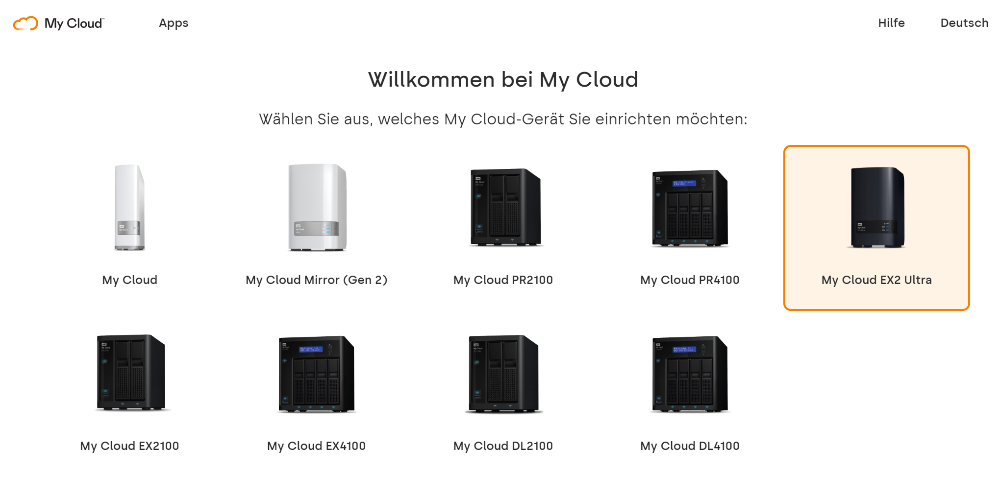
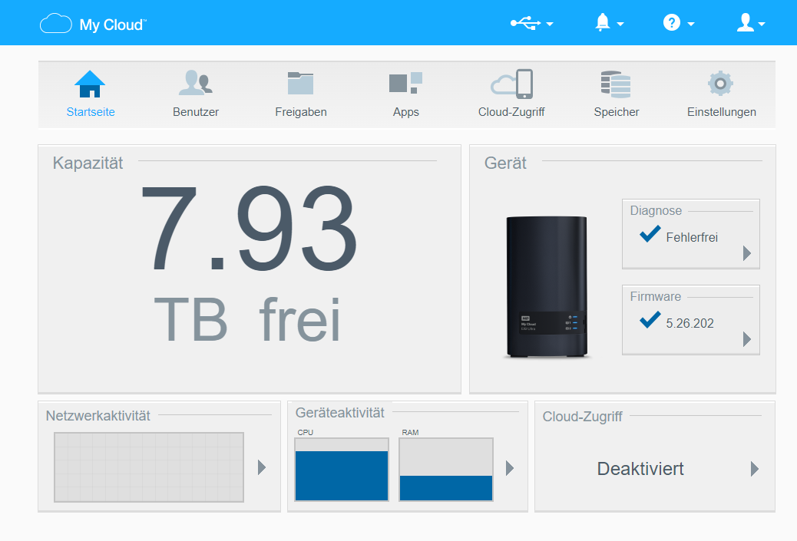

# System vorbereiten

In folgendem Abschnitt wird dir aufgezeigt, wie du das NAS konfigurierst resp. vorbereitest und anschliessend den Plex Media Server installierst.

## NAS in Betrieb nehmen
Als erstes muss das NAS in Betrieb genommen werden. Anbei findest eine kurze Anleitung, wie du vorgehen kannst.

1. NAS an Strom anschliessen und mit Netzwerk verbinden.
2. Folgende Website auf einem Laptop im Browser aufrufen: [https://mycloud.com/setup](https://mycloud.com/setup)
3. Wähle hier dein NAS Modell aus.
 </img>
4. Suche deine Sprache aus.
5. Gib ein Administratorenkennwort für dein NAS ein.
6. Wähle deine Zeitzone.
7. Den Cloud-Zugriff kannst du vorerst überspringen.
8. Hier kannst du auswählen, ob die Firmware deines NAS automatisch aktualisiert werden soll.
9. Wenn du möchtest, kannst du hier dein Produkt noch registrieren.

Jetzt befindest du dich auf der Verwaltungsoberfläche deines NAS. Hier kannst du alle wichtigen Einstellungen vornehmen und kannst den Zustand deines Geräts überwachen.
 </img>

Info: Detaillierte Screenshots zu den einzelnen Schritten findest du [hier](pictures/02_manual-configure-nas/NAS-in-Betrieb-nehmen).

## NAS konfigurieren
Nun kannst du das NAS für den Plex Media Server vorbereiten. Folgende Schritte solltest du dabei berücksichtigen:

- Aktualisiere dein NAS auf die neuste Version. Unter Einstellungen/Firmware-Aktualisierung kannst du die neuste Version installieren.
- Gib dem Gerät einen sinnvollen Namen.
- Weise dem NAS eine fixe IP-Adresse zu, damit es immer unter der gleichen Adresse erreichbar ist. Aber Achtung > vergebe nicht eine bereits vergebene Adresse!
- Erstelle Medienordner für die späterer Ablage der Mediendateien. Es bietet sich hier an eine Freigabe für Plex selbst zu erstellen. 

**Optional**
- Konfiguriere einen Energieplan, damit das NAS z. B. während der Nacht in den Ruhezustand wechselt.

Info: Detaillierte Screenshots zu den einzelnen Schritten findest du [hier](pictures/02_manual-configure-nas/NAS-konfigurieren).

## Plex Media Server installieren
Nun kannst du bereits den Plex Media Server auf deinem NAS installieren. Dazu musst du zuerst von Plex die neuste Version des Media Servers herunterladen.
Diese findest du [hier](https://www.plex.tv/de/media-server-downloads/). Wähle dein NAS aus und lade das Installations-Paket herunter.
Gehe nun auf deinem NAS in den Bereich Apps und klicke links auf die Option "App manuell installieren". Wähle die heruntergeladene Datei aus und installiere die Applikation. Wenn der Plex Media Server erfolgreich installiert ist, wird er links unter installierte Apps angezeigt.

Info: Detaillierte Screenshots zu den einzelnen Schritten findest du [hier](pictures/02_manual-configure-nas/Plex-Media-Server-installieren)

## Plex Media Server erste Schritte
Im Browser kann nun folgende Adresse eingeben: <IP-Adresse>:32400/web
Du wirst nun von Plex durch die ersten Konfigurationsschritte geführt. 

1. Melde dich mit deinem Plex-Login an oder erstelle ein neues.
2. Gibt deinem Plex Media Server einen sinnvollen Namen.
3. Füge bereits, wenn du willst, eine Mediathek hinzu. (Wird später noch genauer beschrieben.)
4. Stelle die Konfiugration fertig.

Info: Detaillierte Screenshots zu den einzelnen Schritten findest du [hier](pictures/02_manual-configure-nas/Plex-Media-Server-erste-Schritte)