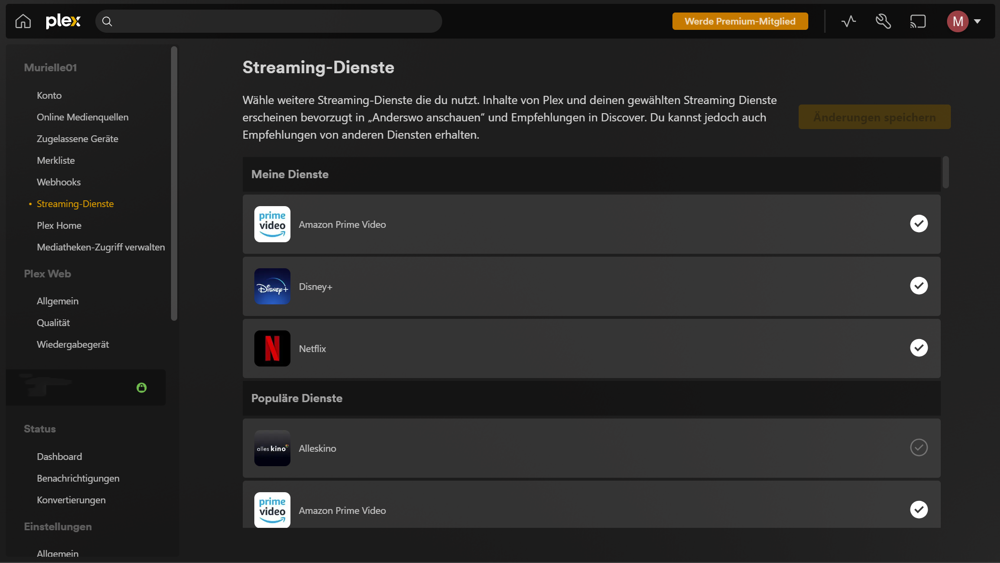
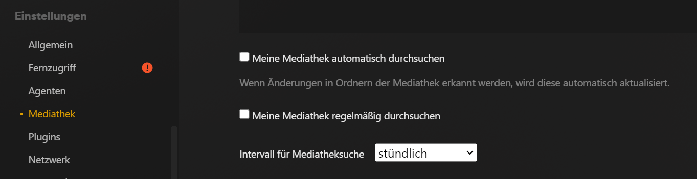
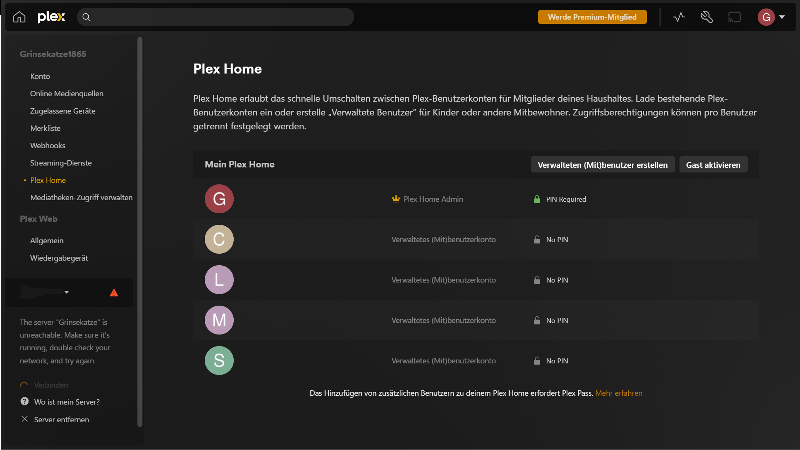
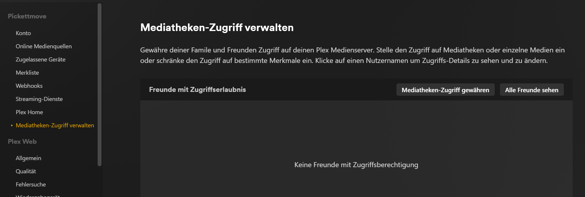

# Plex Media Server konfigurieren
Das NAS ist nun bereit und auch Plex ist installiert. Jetzt kann der Plex Media Server nach den eigenen Wünschen und Bedürfnissen konfiguriert werden. In diesem Abschnitt der Anleitung werden dir einige praktische Funktionen vorgestellt. Du kannst das umsetzen, was dir als nützlich erscheint.

## Mediathek erstellen
Die Mediatheken gehören zu den wichtigsten Funktionen des Plex Media Servers. In ihnen kannst du deine Bilder, Serien, Filme, Musik usw. sortieren und den Usern zur Verfügung stellen. Mediatheken können nur als Administrator/Verwalter bearbeitet werden. Unter Einstellungen/Verwalten/Mediatheken kannst du deine Mediatheken verwalten.

Info: Für eine saubere Struktur empfiehlt es sich in der erstellten "Plex"-Freigabe auf dem NAS einen Ordner für jedes Medium (Filme, Serien, Musik usw.) zu erstellen. So lassen sich später die einzelnen Mediatheken auf dem Server etwas besser verwalten/sortieren.

### Mediathek hinzufügen
Mit der Option "Mediathek hinzufügen" kannst du ganz einfach eine neue Mediathek erstellen. Man kann dabei zwischen Filme, Serien, Musik, Fotos und Andere Videos auswählen und gleich einen Namen festlegen. Anschliessend können ein oder mehrere Medienordner vom NAS ausgewählt und verlinkt werden.
Unter der Punkt "Erweitert" kannst du dannn noch zusätzliche Einstellungen vornehmen. Für Filme und Serien kann hier unter anderem z. B. ausgewählt werden, welche Informationen und wie dargestellt werden sollen (Trailer, Filmtitel usw.). 

Info: Detaillierte Screenshots zu den einzelnen Schritten findest du [hier](pictures/03_manual-configure-plex/Mediathek-erstellen).

### Daten einlesen
Rechts neben der Option "Mediathek hinzufügen" können die Mediathek-Dateien via Button eingelesen werden. Wurden z. B. gerade neue Filme einer Bibliothek hinzugefügt können die Dateien so eingelesen werden, damit sie auch im Plex angezeigt werden.

Info: Das Einlesen der Dateien kannst du auch automatisieren. Unter Einstellungen/Einstellungen/Mediathek kannst du auswählen, ob die Mediatheken nach einer Änderung gleich automatisch aktualisiert werden soll und/oder in welchem Intervall die Mediatheken durchsucht werden sollen.

### Zuordnung anpassen
Wird ein Film automatisch eingelesen, kann es sein, dass die Zuordnung nicht korrekt ist. Du erhälst also Video-Informationen, die eigentlich gar nicht auf die Videodatei zutreffen. Dies kann vorkommen, wenn es mehrere Filme mit dem selben Titel gibt und die Metadaten nicht korrekt ausgelesen werden können. Die Zuordnung musst du dann manuel vornehmen. Gehe dazu zu deinem Film und klicke unten rechts auf die drei Punkte beim Film. Wähle hier die Option "Zuordnung korrigieren ...". Anschliessend kannst du den Film nach Titel und Erscheinungsjahr suchen und die Zuordnung ändern.

### Mediathek bearbeiten und löschen
In der Liste der Mediatheken hat man dann noch zusätzliche Einstellungsmöglichkeiten. Nützlich ist vorallem  die Verwaltung der Empfehlungen, die Verwaltung des Zugriffs sowie die Aktualisierung der Metadaten. Hier kannst du auch eine Mediathek löschen.

## Streamingdienste integrieren
Unter Einstellungen/Streaming-Dienste können aktuelle Streaming-Plattformen mit dem Plex Media Server verlinkt werden (Schnittstelle). Hier findest du eine Liste aller gängigen Streaming-Anbieter darunter Netflix, Disney+, Prime Video usw. Wird ein Streaming-Dienst zum Server hinzugefügt, wird die gesamte Medienauswahl des Anbieters im Plex angezeigt. Vorteil hat dies besonders dann, wenn man z. B. als Familie Abonnements bei verschiedenen Anbietern hat. Möchte man einen bestimmten Film ansehen, kannst du zentral über Plex alle abonnierte Anbieter gleichzeitig durchsuchen und sehen, wo der gesuchte Film verfügbar ist.

Info: Befindet sich ein Film bei einem Streaming-Anbieter und ist nicht lokal auf dem Plex Media Server gespeichert, musst du fürs Abspielen des Films auf die Plattform des entsprechenden Anbieters wechseln. Dazu kann man einfach beim enstprechenden Film unter "Hier anschauen" auf den Anbieter klicken. Du wirst automatisch auf die Wiedergabeseite des Films weitergeleitet und kannst, wenn bereits angemeldet, den Film gleich ansehen.

 </img>

## Einstellung Darstellung Dashboard
Im Dashboard wird standardmässig auch andere Filme angezeigt, die z. B. von Plex zur Verfügung gestellt werden. Willst du diese Medien ausblenden, kannst du unter Einstellungen/Online Medienquellen die einzelnen Anzeigen aktivieren und deaktivieren.

 </img>

## Benutzer verwalten
Die Benutzer für deinen Plex Media Server kannst du unter Einstellungen/Plex Home verwalten. Es gibt hier immer einen "Plex Home Admin". Dieser hat alle Berechtigungen für die Verwaltung des Servers und ist öffentlich sichtbar. (Verwende also keine persönlichen Informationen für den Nutzernamen) Es empfiehlt sich den Admin nur zu verwenden, wenn du administrative Änderungen vornehmen willst. Lege dir zum Streamen daher einen eigenen Benutzer an. Pro Benutzer kann auch ein PIN definiert werden. Damit kannst du sicherstellen, dass Benutzer nicht Dateien von anderen Benutzern einsehen können. Wenn z. B. für Nutzer A ein Fotoalbum freigeben ist, dass Nutzer B nicht sehen darf.

 </img>

Über den Button "Verwalteten Benutzer erstellen" kannst du einen User zum Server hinzufügen. Du kannst ihm einen Namen geben und das Beschränkungsprofil zuweisen. Dort wird z. B. bei der Auswahl "Kleines Kind" der angezeigte Inhalt angepasst. Auf der zweiten Seite kann dann noch ausgewählt werden, ob Downloads für den Benutzer erlaubt sind und ober Live TV nutzen darf.

## Mediatheken-Zugriff verwalten
Im Bereich Einstellungen/Mediatheken-Zugriff verwalten kann der Zugriff auf Mediatheken für externe Benutzer eingerichtet werden. Hat jemand einen Plex-Account und du möchtest ihm eine bestimmte Mediathek freigeben, kannst du ihm hier eine Berechtigung dafür erteilen und dann wieder entziehen.

 </img>