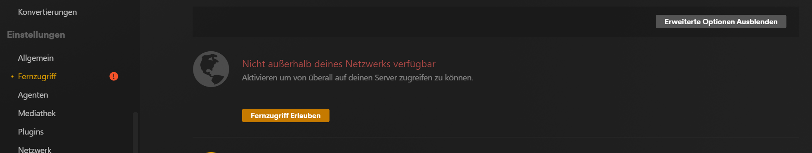

# Plex Media Server mobil nutzen
Auf den Plex Meida Server kann auch mobil zugegriffen werden. Wird der Plex Media Server nicht ins WAN freigegeben, kannst du nur intern in deinem Netzwerk auf die Dateien zugreifen. Folgend erhältst du einen Überblick, wie du Plex mobil nutzen kannst und wie du den Server nach aussen sichtbar machen kannst.

## Plex Web konfigurieren
Wenn man als Administrator im Plex angemeldet ist, kann man unter Einstellungen/Plex Web diverse Einstellungen für die Webclients vornehmen. Von Nutzen ist hier die Qualität, in welcher die Medien wiedergegeben werden und die Fehlersuche.

## Plex App nutzen
Die Plex App gibt es für fast jedes App-fähige Gerät (Windows, IOS, Android) und kann im jeweiligen Store einfach heruntergeladen werden.
Bist du im selben Netzwerk wie der Plex Server kannst du dich gleich automatisch mit dem Server verbinden und dich mit deinem persönlichen Login einwählen. 
Jetzt hast du bereits Zugang zu all deinen Medien.

Detaillierte Scrennshots sind [hier](pictures/configure-plex) abgespeichert.

## Fernzugriff einrichten
Um den Plex Server ins WAN freizugeben muss als erstes unter Einstellungen /Einstellungen/Fernzugriff den Fernzugriff erlaubt werden. Anschliessend musst du auf deinem Router oder deiner Firewall eine Portweiterleitung für den Port 32400 oder einen eigenen Port einrichten.

 </img>

## Fernzugriff Client-Site
