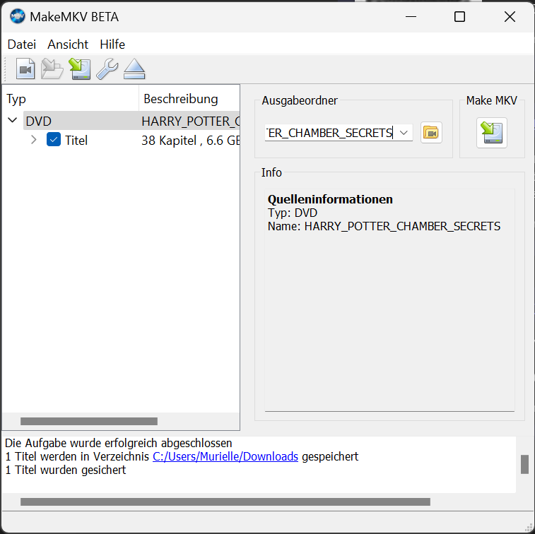

# DVDs digitalisieren
Auf dem Plex Media Server können verschiedene Mediendateien hochgeladen werden. Gerade z. B. Fotoalben können über den Media Server ideal verwaltet und zur Verfügung gestellt werden. Der Hauptfokus von Plex liegt vor allem auch in der Bereitstellung von Filmen und Videomaterial. Im Folgenden wird dir gezeigt, wie du deine DVD-Sammlung im richtigen Format digitalisieren kannst. 

## Dateiformat
Plex kann Videos, die die folgenden Kriterien direkt erfüllen, normalerweise direkt abspielen:

- MP4 als Container.
- H.264-Videocodierung (Level 4.0 oder niedriger).
- AAC (erweiterte Audiokodierung).
- Auflösung: 1920 x 1080 Pixel oder weniger.
- Videobildrate: 30 Bilder pro Sekunde.
- Bittiefe des Videos: 8.

## MakeMKV zum Digitalisieren
MakeMKV ist ein Tool, mit dem du DVDs und Blu-rays für Plex digitalisieren kannst. Es rippt den Inhalt der Discs in das MKV-Format, das von Plex unterstützt wird. Du kannst dann die gerippten MKV-Dateien in Plex importieren und auf verschiedenen Geräten streamen. Beachte jedoch, dass das Rippen kopiergeschützter DVDs ohne Erlaubnis des Urheberrechtsinhabers illegal ist. Stelle also sicher, dass du nur DVDs rippst, für die du die entsprechenden Rechte besitzt oder die nicht urheberrechtlich geschützt sind.

Das Tool findest du hier: [https://www.makemkv.com/](https://www.makemkv.com/)

 </img>